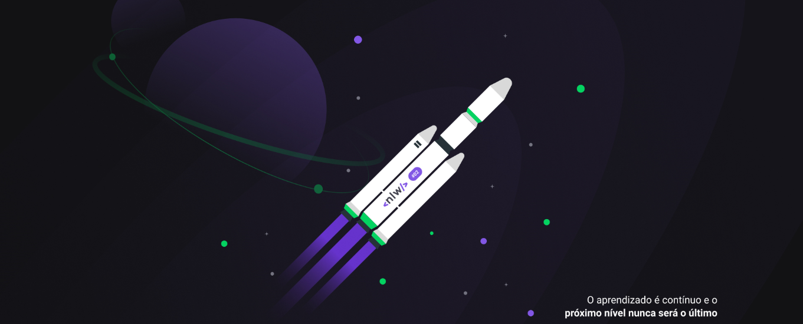

# 🚀 NLW - Next Level Week

<div align="center">
  
</div>

<div align="center">
  
  [](https://rocketseat.com.br/)
  [](https://www.typescriptlang.org/)
  [](https://reactjs.org/)
  [](https://nodejs.org/)
  
</div>

## 📋 Sobre

Este repositório contém todos os **projetos desenvolvidos durante o Next Level Week da Rocketseat** ao longo dos anos. O NLW é um evento gratuito da Rocketseat que acontece várias vezes por ano, oferecendo uma semana intensa de aprendizado com projetos práticos usando as tecnologias mais modernas do mercado.

## 🎯 Projetos Desenvolvidos

### 🤖 NLW-Agents

-   **Descrição**: Projeto focado em inteligência artificial e agentes automatizados
-   **Tecnologias**: TypeScript, React, Node.js
-   **Estrutura**: Server (API) + Web (Frontend)

### ⚽ NLW-Copa

-   **Descrição**: Aplicação para bolões da Copa do Mundo
-   **Tecnologias**: React Native, Next.js, Node.js, Prisma
-   **Estrutura**: Mobile + Web + Server

### 🎮 NLW-eSports

-   **Descrição**: Plataforma para conectar gamers e encontrar duos
-   **Tecnologias**: React, React Native, Node.js, TypeScript
-   **Estrutura**: Explorer + Ignite (Mobile + Web + Server)

### 🏠 NLW-Happy

-   **Descrição**: Aplicação para localização de orfanatos
-   **Tecnologias**: React, React Native, Node.js, TypeORM
-   **Estrutura**: Frontend + Mobile + Backend

### 🔥 NLW-Heat

-   **Descrição**: Aplicação em tempo real para compartilhar expectativas
-   **Tecnologias**: React, Node.js, Socket.io, Prisma
-   **Estrutura**: Frontend + Backend

### 🎵 NLW-Podcast

-   **Descrição**: Plataforma de podcasts com player integrado
-   **Tecnologias**: Next.js, React, TypeScript
-   **Estrutura**: Aplicação web completa

### 🧠 NLW-IA

-   **Descrição**: Aplicação de upload e processamento de vídeos com IA
-   **Tecnologias**: React, Node.js, OpenAI, Prisma
-   **Estrutura**: Web + API

### 🎓 NLW-Proffy

-   **Descrição**: Plataforma de estudos online conectando professores e alunos
-   **Tecnologias**: HTML, CSS, JavaScript, Node.js, SQLite
-   **Estrutura**: Web + Server

### 🚀 NLW-Move-it

-   **Descrição**: Aplicação que combina técnica Pomodoro com exercícios físicos
-   **Tecnologias**: Next.js, React, TypeScript
-   **Estrutura**: Aplicação web

### 💬 NLW-Letmeask

-   **Descrição**: Plataforma para criação de salas de Q&A
-   **Tecnologias**: React, Firebase, TypeScript
-   **Estrutura**: Aplicação web

### 🌌 NLW-Spacetime

-   **Descrição**: Aplicação de cápsula do tempo para guardar memórias
-   **Tecnologias**: Next.js, React Native, Node.js, Prisma
-   **Estrutura**: Web + Mobile + Server

## 🛠️ Tecnologias Utilizadas

<div align="center">
  
  
  
  
  
  
  
  
  
  
  
</div>

## 🚀 Como Executar

Cada projeto possui suas próprias instruções de instalação e execução. Navegue até a pasta do projeto desejado e siga as instruções específicas no README de cada um.

```bash
# Exemplo geral
cd NLW-[NOME-DO-PROJETO]
npm install
npm run dev
```

## 📚 Aprendizados

Durante as diversas edições do NLW, foram abordados conceitos como:

-   ⚡ Desenvolvimento Full Stack
-   📱 Desenvolvimento Mobile com React Native
-   🔥 Aplicações em tempo real
-   🤖 Integração com APIs de IA
-   🎨 UI/UX Design
-   📊 Banco de dados relacionais e não relacionais
-   🔐 Autenticação e autorização
-   🌐 Deploy e hospedagem

## 🤝 Contribuição

Este repositório é pessoal e contém meus projetos desenvolvidos durante o NLW. Sinta-se à vontade para:

-   🌟 Dar uma estrela no repositório
-   🐛 Reportar bugs
-   💡 Sugerir melhorias
-   🔀 Fazer fork para seus próprios estudos

## 📄 Licença

Este projeto está sob a licença MIT. Veja o arquivo [LICENSE](LICENSE) para mais detalhes.

## 🎯 Próximos Passos

-   [ ] Adicionar testes automatizados
-   [ ] Melhorar documentação de cada projeto
-   [ ] Implementar CI/CD
-   [ ] Adicionar demonstrações online

---

<div align="center">
  
  **Desenvolvido com 💜 durante o Next Level Week da Rocketseat**
  
  [](https://rocketseat.com.br/)
  
</div>
